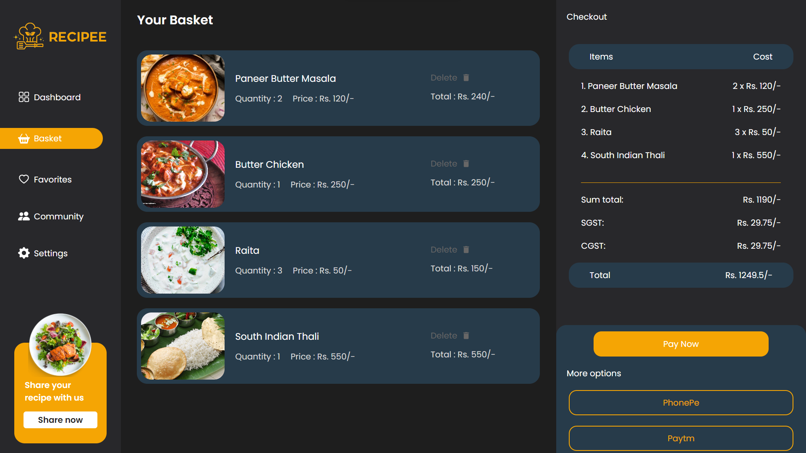
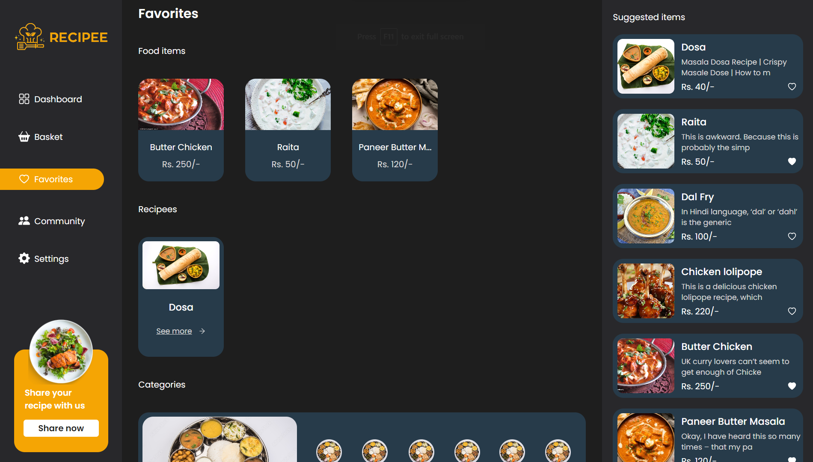
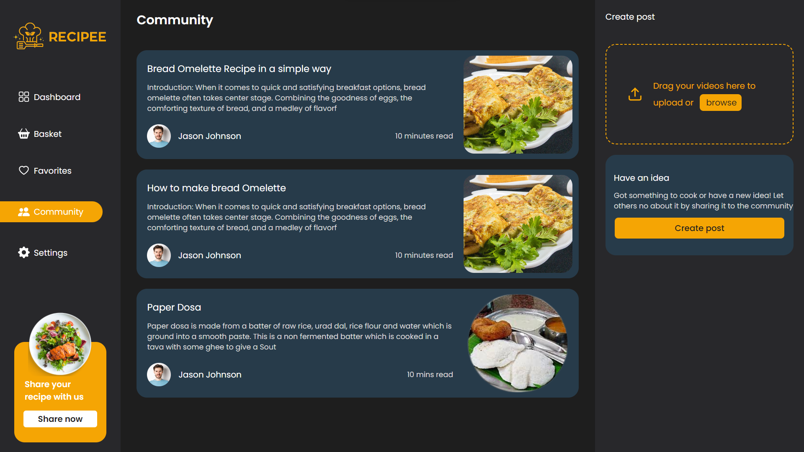
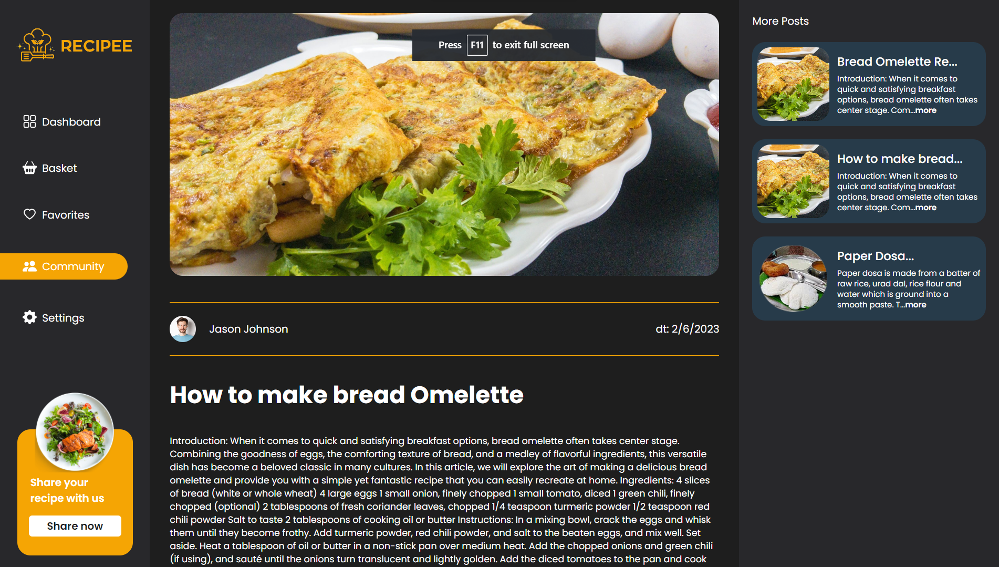
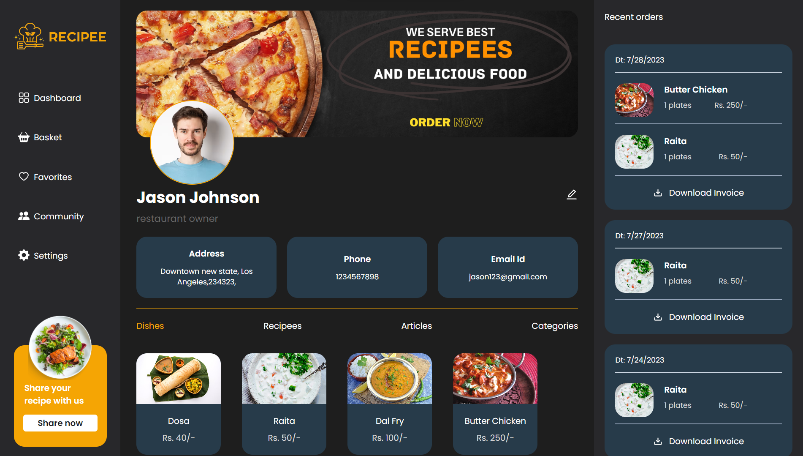

# Client

The client part of the app is developed using react.js to build the main UI of the app. Along with react several other dependencies are employed to make several functionalities come to life. To help connect with the backend apollo client 3 is used which as a advantage provides support for the inMemoryCache functionality. Below are the list of all dependencies that have been used to develop the app.

## Dependencies

- [@apollo/client](https://www.npmjs.com/package/@apollo/client): ^3.7.16
- [@react-pdf/renderer](https://www.npmjs.com/package/@react-pdf/renderer): ^3.1.12
- [@stripe/react-stripe-js](https://www.npmjs.com/package/@stripe/react-stripe-js): ^2.1.1
- [@stripe/stripe-js](https://www.npmjs.com/package/@stripe/stripe-js): ^1.54.1
- [@testing-library/jest-dom](https://www.npmjs.com/package/@testing-library/jest-dom): ^5.16.5
- [@testing-library/react](https://www.npmjs.com/package/@testing-library/react): ^13.4.0
- [@testing-library/user-event](https://www.npmjs.com/package/@testing-library/user-event): ^13.5.0
- [apollo-upload-client](https://www.npmjs.com/package/apollo-upload-client): ^17.0.0
- [browser-image-compression](https://www.npmjs.com/package/browser-image-compression): ^2.0.2
- [chart.js](https://www.npmjs.com/package/chart.js): ^4.3.0
- [graphql](https://www.npmjs.com/package/graphql): ^16.7.1
- [jwt-decode](https://www.npmjs.com/package/jwt-decode): ^3.1.2
- [lottie-react](https://www.npmjs.com/package/lottie-react): ^2.4.0
- [react](https://www.npmjs.com/package/react): ^18.2.0
- [react-chartjs-2](https://www.npmjs.com/package/react-chartjs-2): ^5.2.0
- [react-dom](https://www.npmjs.com/package/react-dom): ^18.2.0
- [react-draggable](https://www.npmjs.com/package/react-draggable): ^4.4.5
- [react-icons](https://www.npmjs.com/package/react-icons): ^4.10.1
- [react-router-dom](https://www.npmjs.com/package/react-router-dom): ^6.12.1
- [react-scripts](https://www.npmjs.com/package/react-scripts): 5.0.1
- [react-switch](https://www.npmjs.com/package/react-switch): ^7.0.0
- [recharts](https://www.npmjs.com/package/recharts): ^2.7.2
- [web-vitals](https://www.npmjs.com/package/web-vitals): ^2.1.4

## Tech Stack

- React.js (for UI development)
- Apollo client 3 (for graphql queries and mutations)
- React-router-dom (for routing)
- React-icons (for icons)
- Stripe (for payment)
- recharts (for charts)
- Lottie-react (for animations)
- React-pdf (for pdf generation)

## Design files

- [Figma](https://www.figma.com/file/WOD57kY9NCnqhjLZ0lipIb/recipee?type=design&node-id=0%3A1&mode=design&t=3FsS3wK6kmwhfgSg-1)

## Color Reference

| Color      | Hex                                                              |
| ---------- | ---------------------------------------------------------------- |
| Yellow     |  #f5a504 |
| Dark gray  |  #28282b |
| Black      |  #1e1e1e |
| Dark blue  |  #273b4a |
| White      |  #ffffff    |
| Text gray  |  #686767 |
| Light gray |  #d9d9d9 |

## Run Locally

Clone the project

```bash
  git clone https://https://github.com/somdev-hub/recipee
```

Go to the project directory

```bash
  cd client
```

Install dependencies

```bash
  npm install
```

Start the server

```bash
  npm run start
```

## Screenshots

- Basket page

#



- Favorites page

#



- Community page

#



- Article page

#



- Profile page

#


