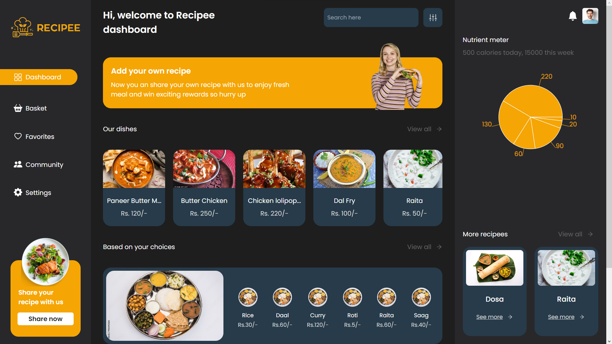

# Recipee app

Welcome to recipee app. Your all in one destination for foods. The main moto of developing this web app is to connect local users with a system where they can get and post their recipes seamlessly. Also if you are a buyer, you can also be a seller if you supply plates of your special cuisine. This is a great way to know about local restaurants and local cuisine that were once invisible to the mass.

# Folder structure

The main file structure is divided into to subfolder i.e client(using react.js for the frontend part) and server(using node.js for the backend part).
Further the subfolders are divided into subfolders based on their functionality. For example, the client folder is divided into components, pages, styles, utils, etc. The server folder is divided into models, resolvers, schemas, utils, etc.

The client folder is further divided into public, src and other necessary files. The src folder is the main folder which contains components, pages, styles, utils, etc. The components folder contains all the components that are used in the app. Each component folder is named after the the component name and further the component folder contains the main jsx file and the corresponding css file. The pages folder contains all the pages that are used in the app. The utils folder contains all the utility functions, images, graphql queries and mutations, fonts, lottie files and sample codes that are used in the app.

The server folder is further divided into subfolders out of which the src folders contains the main server codes. The src folder contains datasources (which further contains models), resolvers, schemas, etc. The models folder contains all the mongoose models that are used in the app. The resolvers folder contains all the resolvers that are used in the app. The schemas folder contains all the graphql schemas that are used in the app. The utils folder contains all the utility functions that are used in the app.

## server

* [public/](./server/public)
  * [images/](./server/public/images)
* [rest/](./server/rest)
  * [index.js](./server/rest/index.js)
* [src/](./server/src)
  * [datasources/](./server/src/datasources)
    * [models/](./server/src/datasources/models)
      * [basket.js](./server/src/datasources/models/basket.js)
      * [category.js](./server/src/datasources/models/category.js)
      * [dishes.js](./server/src/datasources/models/dishes.js)
      * [favorites.js](./server/src/datasources/models/favorites.js)
      * [order-placed.js](./server/src/datasources/models/order-placed.js)
      * [orders.js](./server/src/datasources/models/orders.js)
      * [posts.js](./server/src/datasources/models/posts.js)
      * [profile.js](./server/src/datasources/models/profile.js)
      * [recipees.js](./server/src/datasources/models/recipees.js)
    * [database.js](./server/src/datasources/database.js)
    * [recipee-api.js](./server/src/datasources/recipee-api.js)
  * [resolvers.js](./server/src/resolvers.js)
  * [schema.js](./server/src/schema.js)
* [package-lock.json](./server/package-lock.json)
* [package.json](./server/package.json)
* [server.js](./server/server.js)

## client

* [public/](./client/public)
  * [favicon.ico](./client/public/favicon.ico)
  * [index.html](./client/public/index.html)
  * [logo192 (2).png](./client/public/logo192 (2).png)
  * [logo192.png](./client/public/logo192.png)
  * [logo512.png](./client/public/logo512.png)
  * [manifest.json](./client/public/manifest.json)
  * [robots.txt](./client/public/robots.txt)
* [src/](./client/src)
  * [components/](./client/src/components)
    * [ArticleBar/](./client/src/components/ArticleBar)
    * [BasketCard/](./client/src/components/BasketCard)
    * [Checkout/](./client/src/components/Checkout)
    * [Choices/](./client/src/components/Choices)
    * [CreatePost/](./client/src/components/CreatePost)
    * [Dish/](./client/src/components/Dish)
    * [DishFilter/](./client/src/components/DishFilter)
    * [FilterBar/](./client/src/components/FilterBar)
    * [InfoCard/](./client/src/components/InfoCard)
    * [InfoCard2/](./client/src/components/InfoCard2)
    * [Invoice/](./client/src/components/Invoice)
    * [Loader/](./client/src/components/Loader)
    * [Loader2/](./client/src/components/Loader2)
    * [MobileNavbar/](./client/src/components/MobileNavbar)
    * [PieChart/](./client/src/components/PieChart)
    * [PlacedOrderCard/](./client/src/components/PlacedOrderCard)
    * [PostCreate/](./client/src/components/PostCreate)
    * [Posts/](./client/src/components/Posts)
    * [ProfileBar/](./client/src/components/ProfileBar)
    * [RecipeCard/](./client/src/components/RecipeCard)
    * [RecipeeInfo/](./client/src/components/RecipeeInfo)
    * [RightBar/](./client/src/components/RightBar)
    * [Sidebar/](./client/src/components/Sidebar)
    * [SignUpForm/](./client/src/components/SignUpForm)
    * [SignUpForm2/](./client/src/components/SignUpForm2)
    * [Suggested/](./client/src/components/Suggested)
    * [SuggestionCard/](./client/src/components/SuggestionCard)
  * [pages/](./client/src/pages)
    * [AddCategory/](./client/src/pages/AddCategory)
    * [AddRecipe/](./client/src/pages/AddRecipe)
    * [AllCategories/](./client/src/pages/AllCategories)
    * [AllDishes/](./client/src/pages/AllDishes)
    * [AllRecipees/](./client/src/pages/AllRecipees)
    * [Article/](./client/src/pages/Article)
    * [Basket/](./client/src/pages/Basket)
    * [Community/](./client/src/pages/Community)
    * [Dashboard/](./client/src/pages/Dashboard)
    * [Favorites/](./client/src/pages/Favorites)
    * [Login/](./client/src/pages/Login)
    * [PaymentGateway/](./client/src/pages/PaymentGateway)
    * [Profile/](./client/src/pages/Profile)
    * [Settings/](./client/src/pages/Settings)
    * [SignUp/](./client/src/pages/SignUp)
    * [Success/](./client/src/pages/Success)
  * [utils/](./client/src/utils)
    * [data/](./client/src/utils/data)
    * [fonts/](./client/src/utils/fonts)
    * [graphql/](./client/src/utils/graphql)
    * [lottie/](./client/src/utils/lottie)
    * [ad1.png](./client/src/utils/ad1.png)
    * [base64.js](./client/src/utils/base64.js)
    * [black_logo.png](./client/src/utils/black_logo.png)
    * [confetti.svg](./client/src/utils/confetti.svg)
    * [image_1.png](./client/src/utils/image_1.png)
    * [paid.png](./client/src/utils/paid.png)
    * [profile_background.png](./client/src/utils/profile_background.png)
    * [recipee_logo-cropped.png](./client/src/utils/recipee_logo-cropped.png)
    * [recipee_logo.png](./client/src/utils/recipee_logo.png)
    * [recipee_logo.svg](./client/src/utils/recipee_logo.svg)
    * [welcome_banner1.png](./client/src/utils/welcome_banner1.png)
    * [welcome_banner2.png](./client/src/utils/welcome_banner2.png)
  * [App.css](./client/src/App.css)
  * [App.js](./client/src/App.js)
  * [index.css](./client/src/index.css)
  * [index.js](./client/src/index.js)
* [.gitignore](./client/.gitignore)
* [package-lock.json](./client/package-lock.json)
* [package.json](./client/package.json)
* [README.md](./client/README.md)
* [tailwind.config.js](./client/tailwind.config.js)

# Tech Stack

**Client:** React, GraphQL, Apollo client, TailwindCSS, Rechart library(used for piechart), react-icons(for icons), react-pdf

**Server:** Node, GraphQL, Apollo Server, JWT, MD5, mongoose

**Database:** MongoDB

**Design:** Figma

# Working

The app make use of the robust GraphQL technology as an interface between the client and the server. The client make use of the latest apollo client 3 to run query and mutations to access the data from the backend. The server is composed of apollo server 4 which makes it possible to run queries and mutations on the server side. The server is connected to the MongoDB database using mongoose.

# Features

- Add recipes of your choice
- Restaurant owners can add dishes
- Anyone can post articles and comment on them
- Can add items to basket and make orders
- After successful order, you can download your invoice
- Can view your nutrient consumption
- Add dishes, categories, articles and recipes to favourites
- View your posts and orders in profile page
- Delete your content or account if required

# Screenshots

